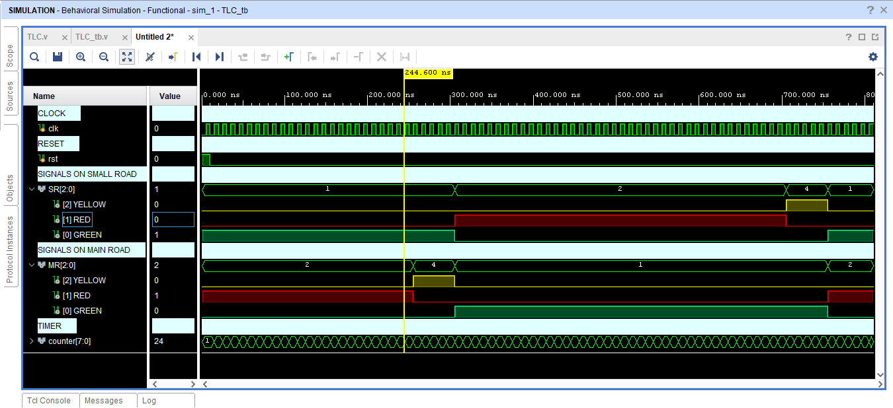
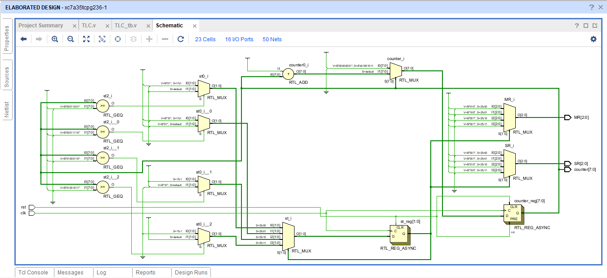

# 🚦 Two-Way Traffic Light Controller FSM

A Finite State Machine (FSM) based Two-Way Traffic Light Controller designed and verified using Verilog HDL.

## Overview

This project implements a Traffic Light Controller for a two-way road intersection. The controller uses a four-state FSM and an 8-bit counter to control traffic signal transitions between the Main Road (MR) and Small Road (SR).

## Features

* FSM-based design
* Four traffic signal states
* Counter-based timing control
* Verilog HDL implementation
* Behavioral simulation in Vivado
* RTL schematic verification

## State Sequence

```text
G_R → G_Y → R_G → Y_G → G_R
```

## Tools Used

* Verilog HDL
* Vivado
* Overleaf

## Simulation Result



## RTL Schematic



## Author

**Priya Nageswari Karanam**
